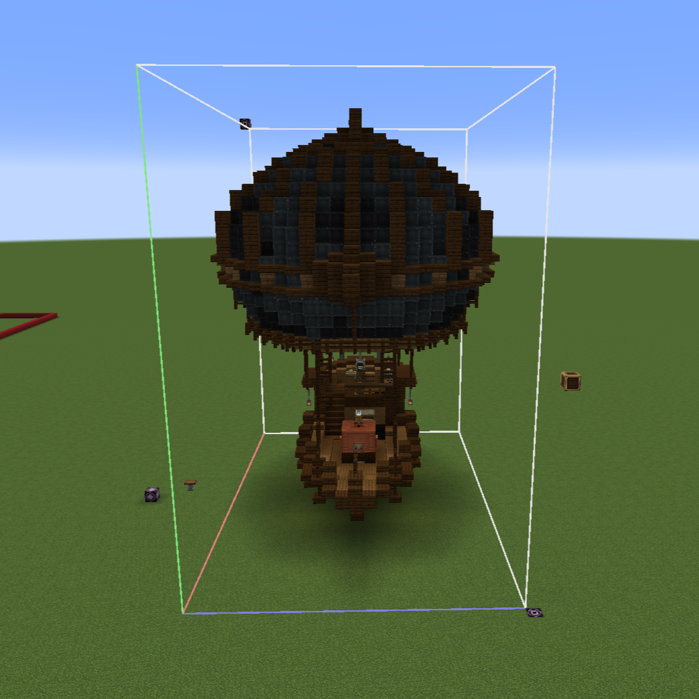

# Adding Custom Ships to Hostile Skies

## WARNING!
**Currently, only balloon based ships that turn with a rudder are supported.** This **WILL** change, but it may take some time.  
<br/>
<br/>
Any datapack (or mod) can add airship encounters to Create: Hostile Skies. A ship consists of two files:

1. **A JSON template** defining the ship's identity, controls, crew, and tuning.
2. **A structure NBT file** saved with a Minecraft structure block.

Both go into a standard datapack folder. Once loaded, `/reload` picks up changes and `/hostileskies ships` lists everything registered.

## Datapack layout

```
my_datapack/
├── pack.mcmeta
└── data/
    └── mypack/                        <-- your namespace
        ├── hostile_skies/
        │   └── ships/
        │       └── my_ship.json       <-- ship template
        └── structure/
            └── my_ship.nbt            <-- structure NBT
```

The JSON lives under `data/<namespace>/hostile_skies/ships/`. The structure NBT lives under `data/<namespace>/structure/` (vanilla's standard structure folder).
The `structure` field in your JSON references the NBT by name. Bare names like `"my_ship"` inherit your datapack's namespace automatically, so you don't need to write `"mypack:my_ship"` 
unless you're referencing a structure from a different namespace.


## Building the structure

Use Minecraft's **structure block** to save the ship. In my testing, Create's Schematic and Quill created problems. A few conventions:

- **Save the ship facing west** The ship's bow must face west, toward negative X. If you save it facing another direction, it may spawn facing the wrong direction in the raid.
This can be fixed by either saving it and placing it facing west, or setting `navigation.spawnYawOffset` to `180` (or 90 / 270 depending on the angle) in the JSON.
- **Careful with chunk borders** This problem SHOULD be solved but Structures that span two or more chunks might only have part of it appear in-game. If this happens let me know.
- **Include all mechanical components.** Everything the ship needs to function must be inside the structure bounds. (Components like bearings and levers)

### Screenshot:

  

Note the position of the lines on the bottom left of the box, they should look like that when you save your ship.

### Seats and spawn points

Use the `crew.captainSpawns` and `crew.crewSpawns` arrays in the JSON to choose where your mobs spawn. All coordinates are relative to the structure origin (the structure block's corner)`[0, 0, 0]`.
To find the right coordinates, stand at the structure's corner, then count the blocks along X, Y, Z to the location.
Reminder that you should check the JSONs for my ships to get a better idea of what it looks like.  

If you want your crew to be seated, you can do so through **seat blocks** found in the structure:

- **Red seats** are captain spawn positions
- **Black seats** are crew spawn positions

### Lever positions

Control lever coordinates in the JSON are (`controls.lift.levers` or `controls.throttle.levers`). These are also structure relative.
 The placement scan logs all discovered throttle levers with their positions, which you can cross-reference. Again, you can check my JSONs for help

## JSON template reference

Basic example:

```json
{
  "name": "My Ship",
  "tier": 1,
  "structure": "my_ship",

  "controls": {
    "lift": {
      "signal": 11,
      "levers": [[9, 2, 3]]
    },
    "throttle": {
      "signal": 12,
      "mercySignal": 6,
      "levers": [[12, 3, 3]]
    }
  },

  "spawning": {
    "spawnDistance": 75,
    "circleRadius": 80,
    "terrainClearance": 40,
    "minAltitudeAboveSea": 60
  },

  "crew": {
    "captain": 1,
    "pillagers": 2,
    "vindicators": 0,
    "captainWeapon": "minecraft:wooden_sword",
    "captainSpawns": [[4, 1, 3]],
    "crewSpawns": [[4, 8, 3], [8, 8, 3]]
  },

  "loot": {
    "containerTable": "hostile_skies:chests/tier1_ship"
  }
}
```

### Fields


| Field | Type | Default | Description                                                                                                                                |
|-------|------|---------|--------------------------------------------------------------------------------------------------------------------------------------------|
| `name` | string | `"Unknown Ship"` | Display name shown in logs and diagnostics.                                                                                                |
| `tier` | int | `1` | Difficulty tier. T1 ships spawn from the start while higher tiers unlock at higher captain kills. Tiers must be between 1 and 4 currently. |
| `structure` | string | *required* | Name of the structure NBT file. Bare names inherit your datapack's namespace.                                                              |

**Controls**

The `controls` map defines named control groups. The navigator currently uses two group names:

- `"lift"`: the lever(s) controlling altitude (balloon burners, steam vents, etc.)
- `"throttle"`: the lever(s) controlling forward speed

Each control group has:

| Field | Type | Default | Description                                                                                                                                                                                                                           |
|-------|------|---------|---------------------------------------------------------------------------------------------------------------------------------------------------------------------------------------------------------------------------------------|
| `signal` | int | `0` | Redstone signal level (0–15) applied during normal flight.                                                                                                                                                                            |
| `mercySignal` | int | `-1` | Signal applied during the mercy phase (when a player dies onboard the ship). Set to `-1` to leave unchanged during mercy. For throttle, this should be lower than `signal` to slow the ship, unless you want the ship to speed up lol |
| `levers` | int[][] | `[]` | Structure-relative `[x, y, z]` positions of throttle levers in this group. Currently these must be Simulated `ThrottleLeverBlock` positions.                                                                                          |

**Navigation**

All navigation fields are optional. Defaults are tuned for a standard balloon + rudder ship. Only override what you need.

| Field | Type | Default | Description                                                                                                                                        |
|-------|------|---------|----------------------------------------------------------------------------------------------------------------------------------------------------|
| `steerCadenceTicks` | int | `30` | Ticks between steering wheel commands. Must exceed the wheel's kinetic sequence duration (~21 ticks for a 90° swing at 16 RPM).                    |
| `headingKp` | double | `1.2` | Proportional gain: wheel degrees per degree of heading error.                                                                                      |
| `headingKd` | double | `6.0` | Derivative gain: wheel degrees per degree/second of error rate.                                                                                    |
| `headingKi` | double | `0.05` | Trim integrator: corrects small steady-state heading drift.                                                                                        |
| `carrotLeadDeg` | double | `30.0` | How far ahead (degrees of arc) the guidance target leads the ship around its orbit.                                                                |
| `spawnYawOffset` | double | `0.0` | Degrees added to spawn orientation. Use `180` if the ship faces positive-X instead of negative-X.                                                  |
| `avoidanceEnabled` | boolean | `true` | Whether terrain avoidance is active.                                                                                                               |
| `lookaheadSeconds` | double | `6.0` | Seconds of travel the terrain probe looks ahead.                                                                                                   |
| `terrainMargin` | double | `8.0` | Minimum clearance in blocks between the bottom of the ship and terrain.                                                                            |
| `liftBoostMax` | int | `3` | Maximum signal levels added to base lift when climbing over terrain. Subject to change when I rewrite the liftboost to be linear instead of on/off |
| `avoidThrottleSignal` | int | `-1` | Throttle signal during avoidance. `-1` disables throttle adjustment.                                                                               |
| `stuckSpeedThreshold` | double | `0.05` | Speed (blocks/tick) below which the ship counts as stuck.                                                                                          |
| `stuckSeconds` | int | `5` | Seconds below threshold before stuck recovery triggers.                                                                                            |
| `unstickSeconds` | int | `10` | Base recovery duration Actual is randomized 1-1.5x. (This is for the rare case in which two ships collide with each other)                         |
| `unstickLiftBoost` | int | `2` | Signal levels added/subtracted from base lift during unstick.                                                                                      |
| `unstickThrottleSignal` | int | `0` | Throttle signal during stuck recovery. `0` or `15` stops most engines, but some don't. Check your ship empirically.                                |

**Spawning**

| Field | Type | Default | Description                                                                                                                                                                                                                                                  |
|-------|------|---------|--------------------------------------------------------------------------------------------------------------------------------------------------------------------------------------------------------------------------------------------------------------|
| `spawnDistance` | double | `75` | How far behind the patrol center the ship spawns (its approach runway).                                                                                                                                                                                      |
| `circleRadius` | double | `80` | Orbit radius. Must exceed the ship's minimum turn radius (`cruise_speed / max_turn_rate`). If the ship can't hold the orbit, increase this. Current recommendation is to make it ~15% bigger than the tightest turn possible for avoidance to work properly. |
| `terrainClearance` | int | `40` | If the ship spawns over land, how many blocks above the terrain it will spawn.                                                                                                                                                                               |
| `minAltitudeAboveSea` | int | `60` | How many blocks it will spawn above sea level.                                                                                                                                                                                                               |

**Crew**

| Field | Type | Default | Description |
|-------|------|---------|-------------|
| `captain` | int | `1` | Number of captains. Captains drop the Captain's Orders item on death. |
| `pillagers` | int | `2` | Number of pillagers. |
| `vindicators` | int | `0` | Number of vindicators. |
| `captainWeapon` | string | `"minecraft:iron_axe"` | Item ID for the captain's held weapon. |
| `captainSpawns` | int[][] | `[]` | Fallback captain positions `[x, y, z]` when no red seats exist in the structure. |
| `crewSpawns` | int[][] | `[]` | Fallback crew positions `[x, y, z]` when no black seats exist in the structure. |

**Loot**

| Field | Type | Default | Description |
|-------|------|---------|-------------|
| `containerTable` | string | `""` | Loot table applied to all containers (barrels, chests) found in the structure, except the captain's chest. Falls back to `minecraft:chests/pillager_outpost` if empty. |
| `captainTable` | string | `""` | Loot table for the captain's chest. Leave empty if the ship has no captain's chest. |
| `captainChest` | int[3] | `null` | Structure-relative `[x, y, z]` of the captain's chest. Required if `captainTable` is set. |

## Diagnostic ladder: tuning a new ship

Getting a ship to orbit smoothly takes tuning. After your ship is integrated, turn on debug mode and run /hostileskies raidlog. Then follow this sequence:  

Again, I want to warn you that this **ONLY WORKS FOR BALLOON AND RUDDER BASED SHIPS** right now.

### 1. Sense check

```
/hostileskies spawnraid <namespace:ship_id>
/hostileskies shipnav sense
```

Spawn the ship and verify: the rudder should be straight on spawn (turn rate near 0), and the ship should be moving at a steady cruise speed. Note the cruise speed.

### 2. Open-loop wheel sweep

```
/hostileskies shipnav wheel (angle)
```

Use this to find the ship's maximum turn rate. Usually it's +- 45 degrees. The ship's minimum turn radius is `cruise_speed / max_turn_rate` (in radians). Set `spawning.circleRadius` comfortably above this, if the circle is too tight the ship will spiral outward.

### 3. Heading hold

```
/hostileskies shipnav hold
```

Verify the closed-loop controller converges on a target heading. If the heading error *grows* during the first correction cycles, this means the rudder turns the ship the opposite direction from what the navigator expects. 
Fix this by adding a gearbox or something to reverse the steering wheel shaft.

### 4. Orbit

Let the ship run its full orbit and observe. Watch for:
- **Orbit too wide:** reduce `circleRadius` (but keep it above the minimum turn radius)
- **Oscillating heading:** reduce `headingKp` or increase `headingKd`
- **Persistent drift off-course:** increase `headingKi`
- **Ship stuck on terrain:** increase `terrainMargin` or `lookaheadSeconds`

## Things to note:


**Rudder type affects diagnostics.** Ships using swivel bearings show a rudder angle in the nav diagnostics. Ships using other bearing types (mechanical bearings, etc.) will show `rudder=NaN`. 
The diagnostics only check swivel bearings because they need to be disassembled before despawn to prevent stray rudder entities.

**`/tick sprint` might mess with physics.** Best not to use it during navigation testing. `/tick rate` might be better but use with caution as Sable's physics may behave weirdly under acceleration.

**Steam vents reset efficiency each tick.** If your ship uses a steam vent, the vent's own `tick()` resets its efficiency from the unformed tank boiler. The mod force-sets efficiency for the first 200 ticks after spawn.

**Structure orientation mismatches.** If only half your ship appears after spawning, the most common cause is an orientation mismatch (the structure was saved facing the wrong direction). Verify that the bow faces negative-X, or set `spawnYawOffset: 180`.

## Examples

The built-in Karve T1 is the simplest reference. Its JSON is at:
```
data/hostile_skies/hostile_skies/ships/karve_t1.json
```

It defines a small 17×7×13 balloon scout with a single propeller, one lift lever (signal 11), one throttle lever (signal 12, mercy signal 6), and a crew of one captain with a wooden sword plus one pillager. No captain's chest, and no navigation overrides.

The Hirdskip T2 (`hirdskip_t2.json`) is a more complex example. Steam-powered, larger crew, captain's chest with a dedicated loot table, explicit crew spawn positions, and navigation overrides for its wider turn radius and different engine behavior.

## Verifying your datapack loaded

After placing your datapack in the `datapacks/` folder (or in the world's `datapacks/` directory):

```
/reload
/hostileskies ships
```

This lists all registered ships with their namespaced IDs. If your ship doesn't appear, check the server log for parse errors. The loader reports exactly which field failed validation.
