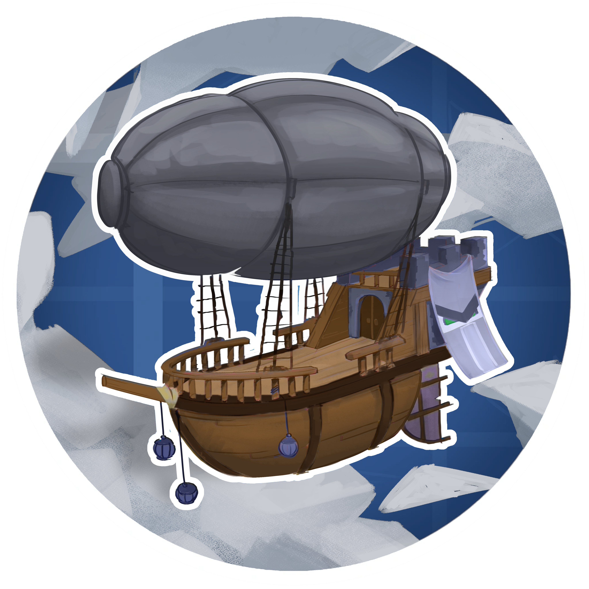

<h1 align="center">Hostile Skies</h1>

    
    

Pillager airship raids for [Create](https://github.com/Creators-of-Create/Create) on NeoForge 1.21.1.

Hostile Skies adds patrolling pillager airships that hunt players from the skies. Every ship is a real Sable sub-level that works normally when claimed.

## Features

- **Airship raids**: pillager ships spawn near players and circle overhead, waiting for a fight
- **Tier progression**: killing raid captains unlocks bigger, badder ships over time
- **Bad Omen integration**: drink an ominous bottle to attract harder raids with multiplied loot
- **Ship capture**: kill the captain and take their Captain's Orders to the helm
- **Mercy system**: dying aboard slows the ship down, giving you a chance to return and finish the raid
- **Pacifist friendly**: players who never engage are never punished
- **Detailed config**: Fully configurable spawn rates, crew scaling, and more

## Dependencies

Required at runtime:

- [Create](https://modrinth.com/mod/create/version/6.0.10+mc1.21.1) 6.0.10+
- [Sable](https://modrinth.com/mod/sable/version/2.0.3+mc1.21.1) 2.0.3+
- [Aeronautics (and simulated)](https://modrinth.com/mod/create-aeronautics/version/w7zlLnea) 1.3.0+

## License

All assets, including ship structure files,
textures, and models are All Rights Reserved. Everything else is under MIT. See [LICENSE.md](LICENSE.md)
for details.

## Thanks to

- The Creators of Create, Sable, and Aeronautics
- Vorteks47 for help building the ships
- Marume for making the logo